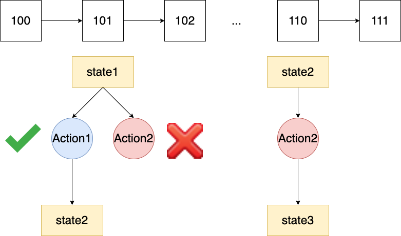
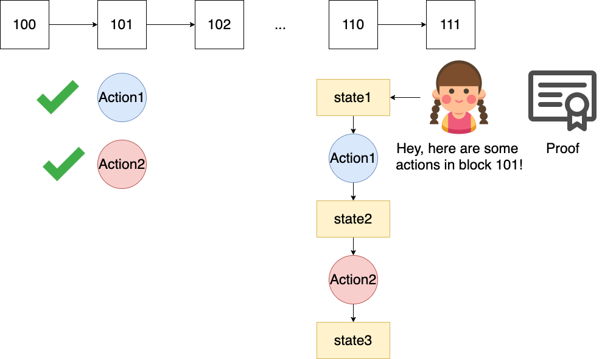

This article explores the possibility of building HTLC contracts on CKB.

# Basic HTLC

HTLC is, in a nutshell, a smart contract with two ways to unlock it.

1. The payer unlocks the cell after a certain block height.
2. The payee unlocks the cell with the preimage of a specific hash.

## Construction

We can do both of these by putting `Timelock` and `Hash` into the `lock.args` of the cell. So, we can get the data structure of HTLC cell as follows

``` 

lock.args:
    <Pubkey_payer> <Pubkey_payee> <Timeout> <Hash of preimage>
Witnesses
    <Flag> <Signature>
    <Flag> <Signature> <preimage>
```

`Flag` indicates which way the signer chose to unlock this cell. For payment, the payee add the preimage to the `witness` . For refunding, the contract will require `since` of refund transaction is equals to `Timelock` in the `args` .

However, you can easily find the flaw in this solution, it doesn't support micro-payments. This is because CKB cells must have at least 61 CKBytes.

# Fused HTLC

I had the [idea](https://talk.nervos.org/t/idea-about-the-composability-of-assets-in-ckb/4855) of fusing the cells together before, so the second version is to use `outputs_data` to fuse all the HTLCs together to solve the CKB minimum cell size limitation. So we can get the following data structure.

``` 

capacity: capacity
lock script: 
	code_hash: <HTLC>  
	hash_type: type 
	args: 
          <Pubkey_payer> <Pubkey_payee> 
          <Timeout1> <Hash of preimage1> 
          <Timeout2> <Hash of preimage2> 
          ...
type script: <Collector type>  
data:{
    <Payment type1> <Payment amount1> 
    <Payment type2> <Payment amount2> 
}

Witnesses
<Flag> <HTLC_index> <Signature>
<Flag> <HTLC_index> <Signature> <preimage>
```

In short, every HTLC payment is split into two parts. `lock.args` stores the information needed for unlocking, while `output_data` stores the type and amount of assets to be unlocked. At this point, the contract looks for the corresponding HTLC based on the `HTLC_index` provided by the user and checks if the unlock logic is correct. Nevertheless, this scheme has the state sharing problem, when both Alice and Bob try to unlock two different HTLCs, only one will succeed.

# Fused HTLC with state sharing

Inspired by [Hydra](https://eprint.iacr.org/2020/299.pdf), I have found that some blockchain applications with specific deadlines can share state. First, let's explain why contracts in UTXO model have state sharing problems. In fact, you can think of a transaction as an **action** on **cell**. In UTXO model, **action** specifies a concrete input **cell state** where account model does not. Therefore, if there are two **action**, **action1** and **action2**, both of them want to change **state_init** of a **cell**. If **action1** is successful, then **state_init** will be changed into **state_changed**. It is a bad news for **action2** since the **state** is inconsistent with what it expects. 



As we can see, two reasons contribute this problem

1. **action** in UTXO model specifies the input **state**.
2. **action** takes effect immediately.

The first reason is a natural property of UTXO, so we cannot change it. But it seems that we can solve this problem by modifying the second property. The answer is to **postpone** the effective time of the action.



In a nutshell, we first submit the **action** to the chain, you can choose to write it to your cell's **output_data**. Note that at this point the **action** does not take effect, it is just a record. Then, after waiting for a specific block height, we prove to the contract that you have previously submitted these **actions** on the blockchain and ask it to execute them in order. 

Then let's go back to the HTLC scenario and you'll see that this solves the state sharing problem. The users no longer need to compete for the usage of the cell, but writes preimage directly their own cells. That's how it works. Next, I'd like give a example to illustrate it. 

## Example

Suppose Alice wants to pay Bob 10 CKB, 15 UDT1 and 20 UDT2. Expiration times are 200, 250, and 300 blocks height, respectively. Also, let's assume that both UDT allow the special type script I mentioned in the [idea](https://talk.nervos.org/t/idea-about-the-composability-of-assets-in-ckb/4855) to create and destroy their UDTs. For the simplicity, I start with the settlement phase of GPC have completed, while the Fused HTLC cell is on the chain and alive. Also, I assume that the minimum CKB required for the current cell is 100 CKBytes. Note that at this point the expiration time of the Fused HTLC cell is set to 300 blocks height, and the refund time is set to 350 blocks.

### The structure of fused HTLCs cell

``` 

Current block height: 150

capacity: 110
lock script: 
	code_hash: <HTLC>  
	hash_type: type 
	args: <Pubkey of Alice> <Pubkey of Bob> 
          <200> <H1> 
          <250> <H2> 
          <300> <H3> 
type script: <Collector type>  
data:{
    <32 * "0">         <10> 
    <Type hash of UDT1> <UDT1_ENCODER(15)> 
    <Type hash of UDT2> <UDT2_ENCODER(20)> 
}
```

1. 32 * "0" represents this asset is CKB.
2. `<UDT1_ENCODER(15)>` means it follows the rules of the corresponding type script. For example, if a type script specifies that the first 8 bytes of `output_data` represent an amount. Then the `<UDT1_ENCODER(15)>` here needs to occupy 8 bytes.

### The structure of proof cell

After that, the user simply sends a transaction to modify the data in the `output_data` before the corresponding block height as follows.

``` 

Current block height: 190

capacity: 110
lock script: Secp lock of Bob
type script: nil
data:{
    1 && p1
    2 && p2
    3 && p3
}
```

`1` is the indexer and `p1` is preimage of `h1` . Please note that here I have submitted all preimages at once for simplicity. In practice, you may not be able to gather them all at the same time. For example, you might receive p3 at 260 blocks, then you should submit p1 and p2 proofs before that to ensure the proof is valid. 

``` 

Current block height: 190

capacity: 110
lock script: Bob secp lock
type script: nil
data:{
    1 && p1
    2 && p2
}

----------------------------

Current block height: 260

capacity: 110
lock script: Bob secp lock
type script: nil
data:{
    3 && p3
}
```

At the same time, we call the corresponding transaction **T**, the block containing **T** are called **B**. After committing, the user can clear the data from the cell after the on-chain confirmation period. 

### The structure of payment transaction

When the block height reaches 200, the user can redeem his money by proving 

``` 

Current block height: 201

Inputs:
    HTLCs Cell:
        capacity: 110
        lock script: 
            code_hash: <HTLC>  
            hash_type: type 
            args: <Alice pubkey> <Bob pubkey> 
                <200> <H1> 
                <250> <H2> 
                <300> <H3> 
        type script: <Collector type>  
        data:{
            <32 * "0">         <10> 
            <Type hash of UDT1> <UDT1_ENCODER(15)> 
            <Type hash of UDT2> <UDT2_ENCODER(20)> 
        }
    Container cell:
        capacity: 500
        lock script: Secp lock of Bob
        type script: nil
        data{
            "0x"
        }
Outputs:
    CKB cell:
        capacity: 71
        lock script: Secp lock of Bob
        type script: nil
        data{
            "0x"
        }    
    UDT1 cell:
        capacity: 100
        lock script: Secp lock of Bob
        type script: UDT1 type script
        data{
            <UDT1_ENCODER(15)> 
        }
    UDT2 cell:
        capacity: 100
        lock script: Secp lock of Bob
        type script: UDT2 type script
        data{
            <UDT2_ENCODER(20)> 
        }
    change cell:
        capacity: 228
        lock script: Secp lock of Bob
        type script: nil
        data{
            "0x"
        }
Witnesses
    <The proof transaction T> <Merkle proof that T is in B> <Signature>
    <Signature> 
```

Here, Bob proves the existence of the corresponding **proof transaction** in `witnesses` . At the same time, we put the hash corresponding to **B** in the `head_deps` so that the HTLC script can verify that the block height where **B** is generated satisfies the requirement. The refund transaction is similar to this one, except that Alice have to wait a little longer and without any proof. This means that if Bob fails to submit the appropriate proof, Alice can take all the left money.


However, this scheme requires all the coins in HTLC can not be withdrawn before the last deadline. For example, there are two HTLCs, one will expire at 100 blocks and another will expire at 500 blocks. They can only get their all money after 500 blocks. One naive mitigation is settling HTLCs in batches. If there are HTLCs which will expire at 100, 110, 120, 500. We can set two batches, one includes 100, 110, 120 and another includes 500. Therefore, the deadline of the first batch is 120 blocks. In this case, the lock time of these coins will not be prolonged very much.  
# Discussion

First, I would like to describe some of the areas of confusion by way of QA.

1. In the final stage, if I intentionally choose to submit multiple batches of action to keep modifying the HTLC status, can I intentionally extend the time it takes to get a refund?

First of all, doing so would require the attacker to pay a commission for multiple transactions, which a rational trader would not do. Second, we can solve it with one-shot submission mechanism, you can find the corresponding content in the [discussion](https://talk.nervos.org/t/gpc-htlc/5009/4). This means that each person is only allowed to submit once. If the attacker chooses not to submit the full **proof cell**, he loses money. Also, because the number of **proof cells** can be very large, one transaction may not fit. Users can negotiate the number of times they allow each other to submit.

2. If there are bi-directional HTLCs, how do I handle them?

Use two cells or develop a more complex sequence of refund and payment.

Then, I would like to discuss the pros and cons of this proposal.

Pros:

* HTLCs can share a single container.
* User can make proof concurrently (state sharing).

Cons

* All funds can not be withdrawn until the latest HTLC expires.
* To perform merle tree validation, the corresponding block **B** must be mature (after four epochs).
* If there are multiple **proof transaction**, the size of payment transaction will be massive.

One more scheme is proposed by my colleague Chao Luo. The principal is HTLCs is fused off-chain, but split on-chain. i.e., users should provide the container to break down the fused HTLCs when they decide to settle the channel on-chain. The advantage of this scheme is user did not need CKBytes in the channel to act as the container. However, they still need to lock some CKBytes when htlcs are on-chain.

These are my thoughts on the implementation of HTLC on CKB, and I would appreciate any comments and questions you may have.
