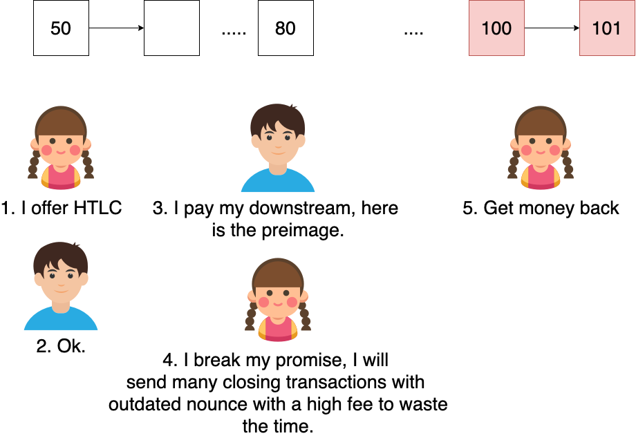
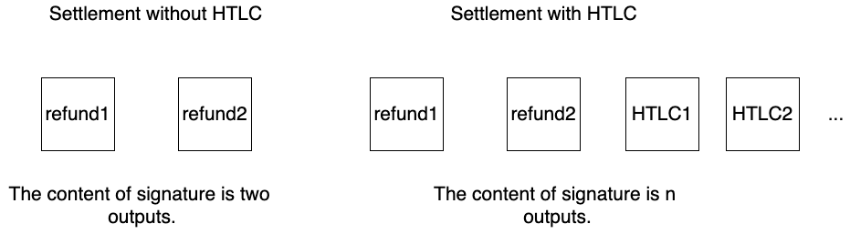
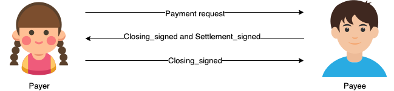
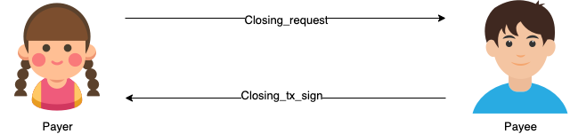
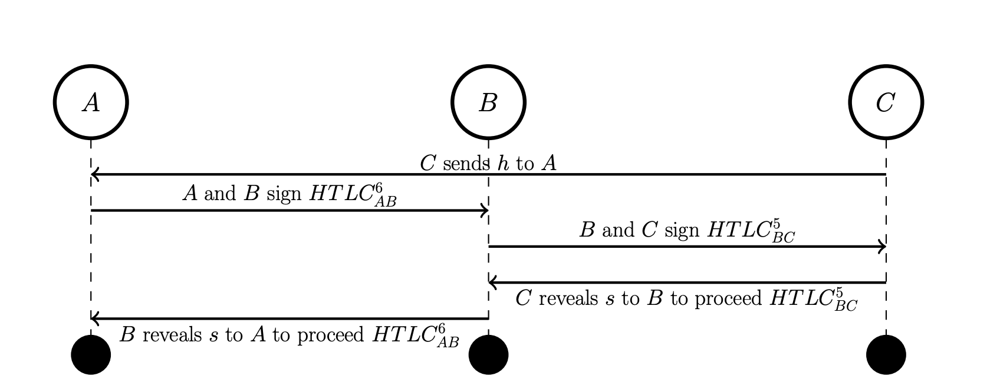
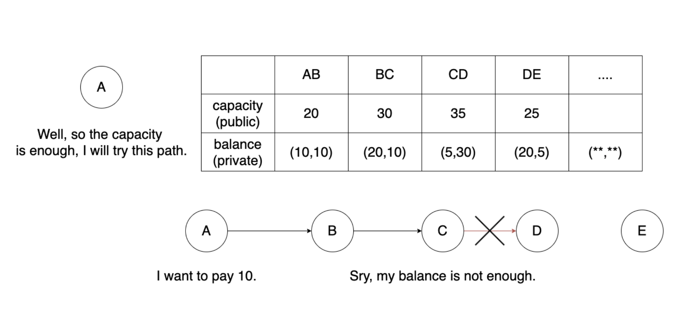
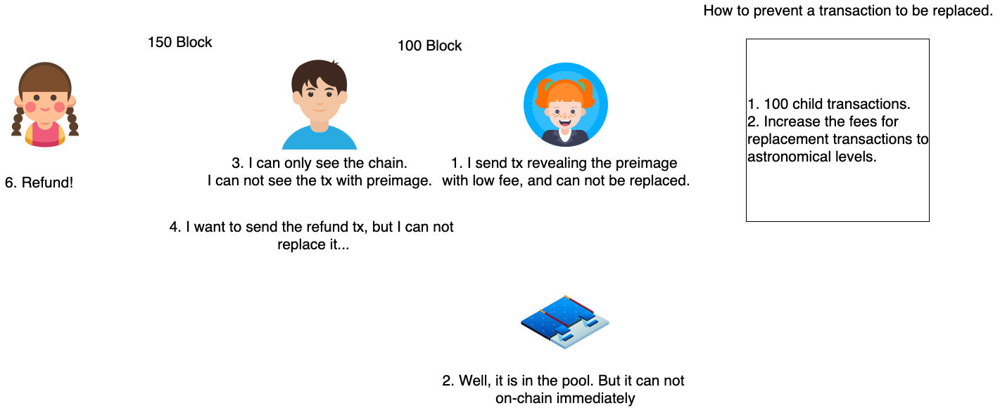
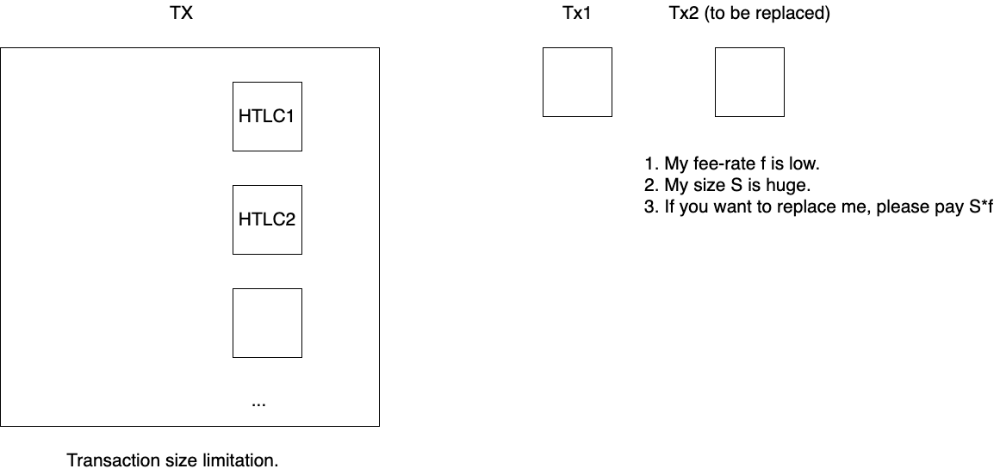
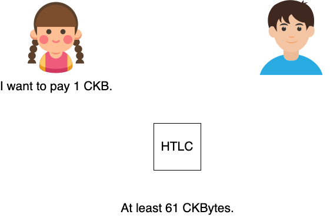

# Outline of Channel
[toc]

This article describes the basic construction of GPC and the problems we need to solve in the future. Before you read this article, make sure you read and understand "[A Generic Payment Channel Construction and Its Composability](https://talk.nervos.org/t/a-generic-payment-channel-construction-and-its-composability/4697)" first.

## GPC

Again, please read the article in the above link first, as this article will not discuss content what is already in that piece of writing.

### Lock & Witness structure

GPC is build upon the default secp-256 script in CKB. And it is essentially a lock script, which can be used by both parties to create and close channels. Let's start with the structure of Lock args and Witness.

``` 

Lock:
<ID> <Status> <Timeout> <Nounce> <Pubkey_A> <Pubkey_B>
Witness
<ID> <Flag> <Nounce> <Signature_A> <Signature_B>
```

Here you'll notice not unlike the structure in [Talk](https://talk.nervos.org/t/a-generic-payment-channel-construction-and-its-composability/4697), there's an extra field called `ID` in Lock args and Witness and an extra `Nounce` in Witness, let me briefly explain why.

For `ID` , let's imagine the following scenario. A and B open a `channel1` using `Pubkey_A` and `Pubkey_B` , and immediately afterwards, A's entire balance is sent to B due to a series of payments. At this point they do not want to close the existing channel, because B can use it to pay A later. Therefore, they then open another `channel2` using the same `Pubkey_A` and `Pubkey_B` . If there is no ID, we can see that the only identifier for a channel is the two `Pubkeys` , which means that I can use Channel2's commitment to close Channel1, which is unacceptable. So I introduced the ID. it is calculated by calculating the Hash value of all inputs of the funding transaction. 

For `Nounce` in `Witness` , this is to ensure a one-to-one mapping between `closing output` and `settlement output` . We need to know which nounce number of closing outputs the settlement corresponds to.

### On-chain Transaction

In this section, I will describe the structure of the different types of transactions and illustrate their role with a complete example. For the sake of simplicity, I will ignore the `cell dep` as well as the `version` field.

#### Funding

Alice and Bob each contributed 500 Ckbytes and 50 UDTs to open this channel, and each contributed 1 Ckbytes as fee. And the minimum capacity of this UDT is 100 Ckbytes. The challenge period is set to 100 relative blocks.

``` 

Inputs:
    Alice's Cell:
        Capacity: 1000 CKbytes.
        Lock:
            code_hash: secp256k1_blake2b lock
            args: <Alice's pubkey hash>
        Type:
            code_hash: UDT code hash
            args: UDT args
        Output_data:
            100 UDT

    Bob's Cell:
        Capacity: 1500 CKbytes.
        Lock:
            code_hash: secp256k1_blake2b lock
            args: <Bob's pubkey hash>
        Type:
            code_hash: UDT code hash
            args: UDT args
        Output_data:
            100 UDT
Outputs:
    GPC:
        Capacity: 1200 CKbytes.
        Lock:
            code_hash: GPC code hash
            args: <ID: Hash of Inputs> <Status: 0> <Timeout: 9223372036854775908> <Nounce: 0> <Alice's pubkey hash> <Bob's pubkey hash>
        Type:
            code_hash: UDT code hash
            args: UDT args
    Alice's ckb change:
        Capacity: 299 CKbytes.
        Lock:
            code_hash: secp256k1_blake2b lock
            args: <Alice's pubkey hash>
        Type:
            nil
    Bob's ckb change:
        Capacity: 799 CKbytes.
        Lock:
            code_hash: secp256k1_blake2b lock
            args: <Bob's pubkey hash>
        Type:
            nil
    Alice's UDT change:
        Capacity: 100 CKbytes.
        Lock:
            code_hash: secp256k1_blake2b lock
            args: <Alice's pubkey hash>
        Type:
            code_hash: UDT code hash
            args: UDT args
    Bob's UDT change:
        Capacity: 100 CKbytes.
        Lock:
            code_hash: secp256k1_blake2b lock
            args: <Bob's pubkey hash>
        Type:
            code_hash: UDT code hash
            args: UDT args
Output_data:
    100 UDT
    0x
    0x
    50 UDT
    50 UDT
Witnesses:
    <valid signature for Alice's pubkey hash>
    <valid signature for Bob's pubkey hash>
```

* "9223372036854775908" represents 100 relative blocks, which references the definition of `since`. 
* We keep UDT and CKB separate when it comes to zeroing. This is good for the user's resource utilization.
* Alice wants to put in 500 CKBytes, but she actually puts in 600. this is because there are 100 CKBytes as CKB containers. If the invested asset is only CKB, then the size of the container will become 61. this also means that only the portion that exceeds 61 CKByte is considered to be available for payments.

#### Closing (The good)

Let's say Alice pays Bob 100 CKB in the meantime as well as 10 UDT. then they plan to work together to close the channel. Again, they each paid a fee of 1 Ckbytes to allow this transaction to be included in the block. And current nounce of commitment is 5.

``` 

Inputs:
    GPC's Cell:
        Capacity: 1200 CKbytes.
        Lock:
            code_hash: GPC code hash
            args: <ID: Hash of Inputs> <Status: 0> <Timeout: 9223372036854775908> <Nounce: 0> <Alice's pubkey hash> <Bob's pubkey hash>
        Type:
            code_hash: UDT code hash
            args: UDT args
        Output_data:
            100 UDT
    Alice's fee Cell:
        Capacity: 101 CKbytes.
        Lock:
            code_hash: secp256k1_blake2b lock
            args: <Alice's pubkey hash>
        Type:
            nil
        Output_data:
            0x
    Bob's fee Cell:
        Capacity: 101 CKbytes.
        Lock:
            code_hash: secp256k1_blake2b lock
            args: <Bob's pubkey hash>
        Type:
            nil
        Output_data:
            0x
Outputs:
    Alice's refund:
        Capacity: 500 CKbytes.
        Lock:
            code_hash: secp256k1_blake2b lock
            args: <Alice's pubkey hash>
        Type:
            code_hash: UDT code hash
            args: UDT args
    Bob's refund:
        Capacity: 700 CKbytes.
        Lock:
            code_hash: secp256k1_blake2b lock
            args: <Bob's pubkey hash>
        Type:
            code_hash: UDT code hash
            args: UDT args
    Alice's ckb change:
        Capacity: 100 CKbytes.
        Lock:
            code_hash: secp256k1_blake2b lock
            args: <Alice's pubkey hash>
        Type:
            nil
    Bob's ckb change:
        Capacity: 100 CKbytes.
        Lock:
            code_hash: secp256k1_blake2b lock
            args: <Bob's pubkey hash>
        Type:
            nil
Output_data:
    40 UDT
    60 UDT
    0x
    0x
Witnesses:
    <ID> <Flag: 0> <Nounce: 5> <valid full tx signature for Alice's pubkey hash> <valid full tx signature for Bob's pubkey hash>
    <valid signature for Alice's pubkey hash>
    <valid signature for Bob's pubkey hash>
```

* You can see that the status of the GPC input lock args is 0, and the flag of the witness is also 0. This means that it is a cooperation closure. So the content of signature is the whole transaction.
* Users need to find additional fee cells to contribute to the transaction fees, this is to ensure the tidiness of the funds in the channel.

#### Closing (The bad/ugly)

Let's say Alice pays Bob 100 CKB in the meantime as well as 10 UDT. then they plan to work together to close the channel. And current nounce of commitment is 5. Alice realized at this point that Bob had lost his response, so Alice is ready to close the channel unilaterally.

``` 

Inputs:
    GPC's Cell:
        Capacity: 1200 CKbytes.
        Lock:
            code_hash: GPC code hash
            args: <ID: Hash of Inputs> <Status: 0> <Timeout: 9223372036854775908> <Nounce: 0> <Alice's pubkey hash> <Bob's pubkey hash>
        Type:
            code_hash: UDT code hash
            args: UDT args
        Output_data:
            100 UDT
    Alice's fee Cell:
        Capacity: 101 CKbytes.
        Lock:
            code_hash: secp256k1_blake2b lock
            args: <Alice's pubkey hash>
        Type:
            nil
        Output_data:
            0x
Outputs:
    GPC's output:
        Capacity: 1200 CKbytes.
        Lock:
            code_hash: GPC code hash
            args: <ID: Hash of Inputs> <Status: 1> <Timeout: 9223372036854775908> <Nounce: 5> <Alice's pubkey hash> <Bob's pubkey hash>
        Type:
            code_hash: UDT code hash
            args: UDT args
        Output_data:
            100 UDT
    Alice's ckb change:
        Capacity: 100 CKbytes.
        Lock:
            code_hash: secp256k1_blake2b lock
            args: <Alice's pubkey hash>
        Type:
            nil
Output_data:
    100 UDT
    0x
Witnesses:
    <ID> <Flag: 1> <Nounce: 5> <valid no-input-signature for Alice's pubkey hash> <valid no-input-signature for Bob's pubkey hash>
    <valid signature for Alice's pubkey hash>
```

* The GPC `lock args` have changed,   `status` has changed to 1, indicating that the channel state has changed from established to closing, and `Nounce` has been updated to 5.
* Here the signature is no-input-signature, this is to ensure that the corresponding Closing output can be spliced after any input. One of the most direct advantage you can see is that I've linked the closing output with a `Nounce` of 5 to the funding output with a `Nounce` of 0. Also, if the `Nounce` on the current chain is 1, I can also just use the closing output with a `Nounce` of 5. This is the power of no-input-signature.

#### Settlement

Following the above unilateral closing, here I give the structure of the settlement transaction.

``` 

Inputs:
    GPC's Cell:
        Capacity: 1200 CKbytes.
        Lock:
            code_hash: GPC code hash
            args: <ID: Hash of Inputs> <Status: 1> <Timeout: 9223372036854775908> <Nounce: 5> <Alice's pubkey hash> <Bob's pubkey hash>
        Type:
            code_hash: UDT code hash
            args: UDT args
        Output_data:
            100 UDT
        Since:
            9223372036854775908
    Alice's fee Cell:
        Capacity: 101 CKbytes.
        Lock:
            code_hash: secp256k1_blake2b lock
            args: <Alice's pubkey hash>
        Type:
            nil
        Output_data:
            0x
Outputs:
    Alice's refund:
        Capacity: 500 CKbytes.
        Lock:
            code_hash: secp256k1_blake2b lock
            args: <Alice's pubkey hash>
        Type:
            code_hash: UDT code hash
            args: UDT args
    Bob's refund:
        Capacity: 700 CKbytes.
        Lock:
            code_hash: secp256k1_blake2b lock
            args: <Bob's pubkey hash>
        Type:
            code_hash: UDT code hash
            args: UDT args
    Alice's ckb change:
        Capacity: 100 CKbytes.
        Lock:
            code_hash: secp256k1_blake2b lock
            args: <Alice's pubkey hash>
        Type:
            nil
Output_data:
    40 UDT
    60 UDT
    0x
Witnesses:
    <ID> <Flag: 0> <Nounce: 5> <valid no-input-signature for Alice's pubkey hash> <valid no-input-signature for Bob's pubkey hash>
    <valid signature for Alice's pubkey hash>
```

* We have specified in the contract that if the current status of the `lock args` is 1 and this is a settelment transaction (`Witness`'s `Flag` is 0). Then it will force the current GPC `input` `since` to be equal to the `Timeout` in the GPC input `lock args`, thus implementing the challenge period.

#### Example

In the following I will use an example to illustrate the overall process. 

1. Alice and Bob each contributed 500 Ckbytes and 50 UDTs to open this channel, and each contributed 1 Ckbytes as fee. And the minimum capacity of this UDT is 100 Ckbytes. The challenge period is set to 100 relative blocks.
2. Alice pays Bob 100 CKBytes and 10 UDTs, at which point `Nounce` is 1.
3. Alice pays Bob 5 CKBytes and 10 UDTs, at which point `Nounce` is 2.
4. Alice pays Bob 5 CKBytes and 10 UDTs, at which point `Nounce` is 3.
5. Alice intends to cheat and submits the closing transaction with a `Nounce` of 1.
6. Bob finds out that Alice's transaction is on-chain and Bob then submits the closing transaction with `Nounce` of 3.
6. Bob waits for the challenge period to pass and submits a settlement transaction for settlement.

Funding

``` 

Inputs:
    Alice's Cell:
        Capacity: 1000 CKbytes.
        Lock:
            code_hash: secp256k1_blake2b lock
            args: <Alice's pubkey hash>
        Type:
            code_hash: UDT code hash
            args: UDT args
        Output_data:
            100 UDT

    Bob's Cell:
        Capacity: 1500 CKbytes.
        Lock:
            code_hash: secp256k1_blake2b lock
            args: <Bob's pubkey hash>
        Type:
            code_hash: UDT code hash
            args: UDT args
        Output_data:
            100 UDT
Outputs:
    GPC:
        Capacity: 1200 CKbytes.
        Lock:
            code_hash: GPC code hash
            args: <ID: Hash of Inputs> <Status: 0> <Timeout: 9223372036854775908> <Nounce: 0> <Alice's pubkey hash> <Bob's pubkey hash>
        Type:
            code_hash: UDT code hash
            args: UDT args
    Alice's ckb change:
        Capacity: 299 CKbytes.
        Lock:
            code_hash: secp256k1_blake2b lock
            args: <Alice's pubkey hash>
        Type:
            nil
    Bob's ckb change:
        Capacity: 799 CKbytes.
        Lock:
            code_hash: secp256k1_blake2b lock
            args: <Bob's pubkey hash>
        Type:
            nil
    Alice's UDT change:
        Capacity: 100 CKbytes.
        Lock:
            code_hash: secp256k1_blake2b lock
            args: <Alice's pubkey hash>
        Type:
            code_hash: UDT code hash
            args: UDT args
    Bob's UDT change:
        Capacity: 100 CKbytes.
        Lock:
            code_hash: secp256k1_blake2b lock
            args: <Bob's pubkey hash>
        Type:
            code_hash: UDT code hash
            args: UDT args
Output_data:
    100 UDT
    0x
    0x
    50 UDT
    50 UDT
Witnesses:
    <valid signature for Alice's pubkey hash>
    <valid signature for Bob's pubkey hash>
```

Alice cheats

``` 

Inputs:
    GPC's Cell:
        Capacity: 1200 CKbytes.
        Lock:
            code_hash: GPC code hash
            args: <ID: Hash of Inputs> <Status: 0> <Timeout: 9223372036854775908> <Nounce: 0> <Alice's pubkey hash> <Bob's pubkey hash>
        Type:
            code_hash: UDT code hash
            args: UDT args
        Output_data:
            100 UDT
    Alice's fee Cell:
        Capacity: 101 CKbytes.
        Lock:
            code_hash: secp256k1_blake2b lock
            args: <Alice's pubkey hash>
        Type:
            nil
        Output_data:
            0x
Outputs:
    GPC's output:
        Capacity: 1200 CKbytes.
        Lock:
            code_hash: GPC code hash
            args: <ID: Hash of Inputs> <Status: 1> <Timeout: 9223372036854775908> <Nounce: 1> <Alice's pubkey hash> <Bob's pubkey hash>
        Type:
            code_hash: UDT code hash
            args: UDT args
        Output_data:
            100 UDT
    Alice's ckb change:
        Capacity: 100 CKbytes.
        Lock:
            code_hash: secp256k1_blake2b lock
            args: <Alice's pubkey hash>
        Type:
            nil
Output_data:
    100 UDT
    0x
Witnesses:
    <ID> <Flag: 1> <Nounce: 1> <valid no-input-signature for Alice's pubkey hash> <valid no-input-signature for Bob's pubkey hash>
    <valid signature for Alice's pubkey hash>
```

Bob challenges

``` 

Inputs:
    GPC's Cell:
        Capacity: 1200 CKbytes.
        Lock:
            code_hash: GPC code hash
            args: <ID: Hash of Inputs> <Status: 1> <Timeout: 9223372036854775908> <Nounce: 1> <Alice's pubkey hash> <Bob's pubkey hash>
        Type:
            code_hash: UDT code hash
            args: UDT args
        Output_data:
            100 UDT
    Bob's fee Cell:
        Capacity: 101 CKbytes.
        Lock:
            code_hash: secp256k1_blake2b lock
            args: <Bob's pubkey hash>
        Type:
            nil
        Output_data:
            0x
Outputs:
    GPC's output:
        Capacity: 1200 CKbytes.
        Lock:
            code_hash: GPC code hash
            args: <ID: Hash of Inputs> <Status: 1> <Timeout: 9223372036854775908> <Nounce: 3> <Alice's pubkey hash> <Bob's pubkey hash>
        Type:
            code_hash: UDT code hash
            args: UDT args
        Output_data:
            100 UDT
    Bob's ckb change:
        Capacity: 100 CKbytes.
        Lock:
            code_hash: secp256k1_blake2b lock
            args: <Bob's pubkey hash>
        Type:
            nil
Output_data:
    100 UDT
    0x
Witnesses:
    <ID> <Flag: 1> <Nounce: 3> <valid no-input-signature for Alice's pubkey hash> <valid no-input-signature for Bob's pubkey hash>
    <valid signature for Alice's pubkey hash>
```

Bob settles

``` 

Inputs:
    GPC's Cell:
        Capacity: 1200 CKbytes.
        Lock:
            code_hash: GPC code hash
            args: <ID: Hash of Inputs> <Status: 1> <Timeout: 9223372036854775908> <Nounce: 3> <Alice's pubkey hash> <Bob's pubkey hash>
        Type:
            code_hash: UDT code hash
            args: UDT args
        Output_data:
            100 UDT
        Since:
            9223372036854775908
    Bob's fee Cell:
        Capacity: 101 CKbytes.
        Lock:
            code_hash: secp256k1_blake2b lock
            args: <Bob's pubkey hash>
        Type:
            nil
        Output_data:
            0x
Outputs:
    Alice's refund:
        Capacity: 490 CKbytes.
        Lock:
            code_hash: secp256k1_blake2b lock
            args: <Alice's pubkey hash>
        Type:
            code_hash: UDT code hash
            args: UDT args
    Bob's refund:
        Capacity: 710 CKbytes.
        Lock:
            code_hash: secp256k1_blake2b lock
            args: <Bob's pubkey hash>
        Type:
            code_hash: UDT code hash
            args: UDT args
    Bob's ckb change:
        Capacity: 100 CKbytes.
        Lock:
            code_hash: secp256k1_blake2b lock
            args: <Bob's pubkey hash>
        Type:
            nil
Output_data:
    20 UDT
    80 UDT
    0x
Witnesses:
    <ID> <Flag: 0> <Nounce: 5> <valid no-input-signature for Alice's pubkey hash> <valid no-input-signature for Bob's pubkey hash>
    <valid signature for Alice's pubkey hash>
```


### TODO

#### One shot GPC

###### [Problem statement](https://talk.nervos.org/t/gpc-htlc/5009)



###### Potential solution

Only one commit closing per node is allowed. To accomplish this, we first need to modify the lock args. More specifically, two new fields have been added to indicate whether or not a corresponding pubkey can still commit closing transaction.

``` 

Original
<ID> <Status> <Timeout> <Nounce> <Pubkey_A> <Pubkey_B> 

One shot
<ID> <Status> <Timeout> <Nounce> <Pubkey_A> <Allow_submit_A> <Pubkey_B> <Allow_submit_B>
```

In addition, a new signature is to be added to the witness to indicate who submitted this closing transaction.

``` 

Original
<ID> <Flag> <Nounce> <Signature_A> <Signature_B>

One shot
<ID> <Flag> <Nounce> <Signature_A> <Signature_B> <submission_signature>
```

Submission_Signature should be a signature for the entire closing transaction. At the same time, we need to ensure the Allow_submit field corresponding to signature should be  1 in the input and 0 in the output. Also, they need to exchange signatures in two cases, where the other party's Allow_submit field is 0 and is 1.

#### No-input-signature for customizable signature content.

###### Problem statement



###### Potential solution

Lock args:

``` 

Original
<ID> <Status> <Timeout> <Nounce> <Pubkey_A> <Pubkey_B> 

with HTLC
<ID> <Status> <Timeout> <Nounce> <Pubkey_A> <Pubkey_B> <Sig_range>
```

## Single hop
### Interaction between users

#### Establishment

#### Make payments

#### Closing


### TODO
* Fee negotiation.
* Retransmission mechanism。
* Formal definition.

## Multi hop



### TODO

#### Griefing attack.

###### Problem statement


###### Potential solution

   * [Proof of closure](https://lists.linuxfoundation.org/pipermail/lightning-dev/2020-April/002608.html).
   * [Griefing penalty](https://arxiv.org/abs/2005.09327) (I think it does not work.)

#### Routing. 

###### Problem statement



###### Potential solution

   * [Noisy mechanism](https://arxiv.org/abs/1909.02717).

#### Pinning attack

###### Problem statement



###### Potential solution

   * Monitor the mempool.
   * Anchor output. (I do not think it can solve the problem. A can still pin the tx with other )

#### How to merge HTLCs

###### Problem statement



###### Potential solution

   * Merkle Tree?

#### HTLC dust

###### Problem statement



###### Potential solution

#### Same payment hash

###### Problem statement

   * [Wormhole attack](https://eprint.iacr.org/2018/472.pdf)
   * [Payment traps](https://bitcoinops.org/en/newsletters/2020/10/28/#full-disclosures-of-recent-lnd-vulnerabilities)
   * privacy(Nodes can know whether they are in the same path.)

###### Potential solution

   * [PTLC](https://suredbits.com/payment-points-part-1/) (I am not sure.)

## Watchtower
